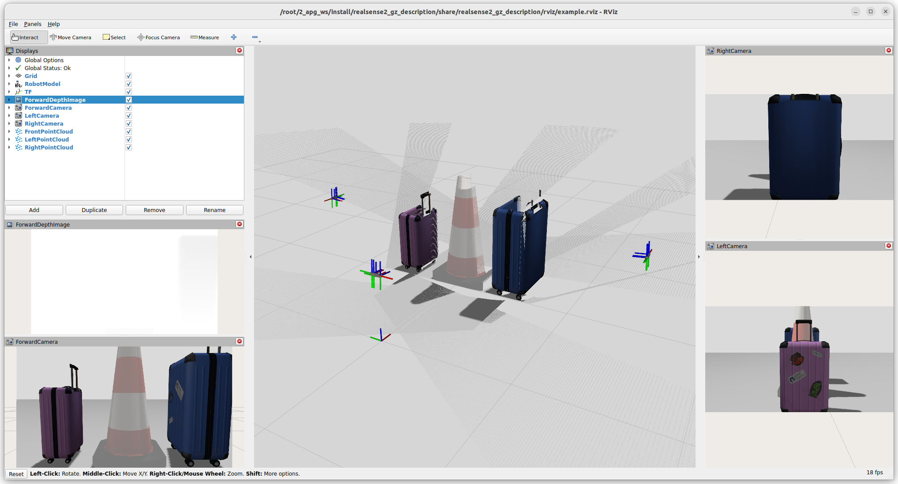

# Gazebo Sensor Descriptions

[](https://github.com/locusrobotics/gz_sensor_descriptions/actions/workflows/format.yaml)

This repo is designed to make it easy to simulate Gazebo sensors and use/define them in your robots URDF.
It includes ROS2 URDF xacro's that properly define and configure the sensors for Gazebo.
Currently cameras (RGB, Depth or RGBD) are the only sensors supported but more will be added.

This repo also offers convenient packages of common off the shelf sensors to make it easy to switch between simulation and hardware for the supported devices. If you would like your sensor added here please feel free to make a PR.

Example Realsense multi-camera simulation bridged to ROS 2:


The repo is divided up into 3 packages:
- `gz_camera_macros` includes generic ROS xacro's that can be used to make a supported camera types
- `realsense2_gz_description` includes xacros to define cameras in Gazebo that emulate a Realsense device available in `realsense2_description`
- `orbbec_gz_description` includes xacros to define cameras in Gazebo that emulate a Orbbec device available in the `orbbec_description` package on the [locus](https://github.com/locusrobotics/OrbbecSDK_ROS2/tree/locus) branch

In the [package.xml](gz_camera_macros/package.xml) of the generic macros or even a specific camera like the [Realsense](realsense2_gz_description/package.xml)
they do not require Gazebo be installed because they are just xacro definitions.
You need the following packages available if you would like to run the simulator and example launch files.
```xml
  <depend>robot_state_publisher</depend>
  <depend>image_proc</depend>
  <depend>ros_gz_bridge</depend>
  <depend>ros_gz_sim</depend>
  <depend>rviz2</depend>
```

# Known Issues
Gazebo parameter [optical_frame_id](https://github.com/gazebosim/gz-sensors/blob/fc8692c075001e9379d1ffe84c19149f49b43da5/src/CameraSensor.cc#L715-L716) is deprecated and will be removed at some point.
Attempting to use the `<sensor>`/`<gz_frame_id>` parameter to correct the frame_id for the camera_info topic does not to play nice and results in lots of
`XML Element[gz_frame_id], child of element[sensor], not defined in SDF. Copying[gz_frame_id] as children of [sensor].`
warnings printed for each camera instance.

The RGBD camera does NOT use the parameter `optical_frame_id` correctly any more and publishes the data with an incorrect frame_id.

### Usage

In your robots URDF....

1. Include and run your camera's description xacro:
```xml
<xacro:include filename="$(find realsense2_description)/urdf/_d415.urdf.xacro" />
...
<xacro:sensor_d415 parent="my_robots_camera_mount_link" name="$(arg camera_name)">
  <origin xyz="0 0 0" rpy="0 0 0"/> <!-- This robot's camera mount is aligned with the camera base -->
</xacro:sensor_d415>
```

2. Selectivly include Gz xacro with `if(sim_gazebo)` if you don't want the definition included when running with hardware:
```xml
<xacro:if value="${sim_gazebo}">
  <xacro:include filename="$(find realsense2_gz_description)/urdf/_d415.gazebo.xacro" />
  <xacro:gazebo_d415 name="$(arg camera_name)" gz_topic_name="$(arg camera_name)" type="rgbd" fps="15"/>
</xacro:if>
```
> Note: Gazebo plugins can only be included once so the xacros in this repo assume that a parent will include/run the required Sensors plugin when starting simulation.
This plugin can be started from your URDF or world.sdf file.
```xml
<gazebo>
  <plugin filename="gz-sim-sensors-system" name="gz::sim::systems::Sensors">
    <render_engine>ogre2</render_engine>
  </plugin>
</gazebo>
```

3. When simulating add to your robot's Gazebo launch file to start and configure the bridge `Node` so that you can see the simulated data as ROS topics:
```python
# Bridge
gazebo_bridge = Node(
    package="ros_gz_bridge",
    executable="parameter_bridge",
    parameters=[{"use_sim_time": True}],
    arguments=[
        "/wrist_camera/image@sensor_msgs/msg/Image[gz.msgs.Image",
        "/wrist_camera/depth_image@sensor_msgs/msg/Image[gz.msgs.Image",
        "/wrist_camera/points@sensor_msgs/msg/PointCloud2[gz.msgs.PointCloudPacked",
        "/wrist_camera/camera_info@sensor_msgs/msg/CameraInfo[gz.msgs.CameraInfo",
        "/clock@rosgraph_msgs/msg/Clock[gz.msgs.Clock",
    ],
    remappings=[
        (
            "/wrist_camera/image",
            "/wrist/camera/color/image_raw",
        ),
        (
            "/wrist_camera/depth_image",
            "/wrist/camera/depth_registered/image_rect",
        ),
        (
            "/wrist_camera/points",
            "/wrist/camera/depth/color/points",
        ),
        (
            "/wrist_camera/camera_info",
            "/wrist/camera/color/camera_info",
        ),
        (
            "/wrist_camera/camera_info",
            "/wrist/camera/depth_registered/camera_info",
        )
    ],
    output="screen",
)
```

## Package Documentation:

- [Generic Gazebo Camera macros](gz_camera_macros/README.md)
- [Realsense2 Gazebo Camera macros](realsense2_gz_description/README.md)

## Contributing

pre-commit is a tool to automatically run formatting checks on each commit, which saves you from manually running them.
This repo requires formatting to pass before changes will be accepted.

Install pre-commit like this:

```
pip3 install pre-commit
```

Run this in the top directory of the repo to set up the git hooks:

```
pre-commit install
```
